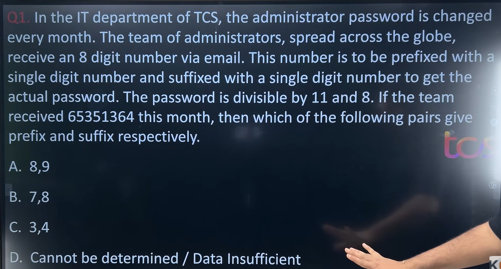

This is a very good **TCS Number System** question because it combines **Divisibility by 8** and **Divisibility by 11**.

The biggest mistake students make is trying all the options directly. Instead, solve it **logically by eliminating options**, which is exactly the style you like.

---

# Step 1: Understand the question

We are given an 8-digit number:

```text
65351364
```

We have to:

* Add **one digit at the beginning (prefix)**
* Add **one digit at the end (suffix)**

So the final number becomes

```text
Prefix 65351364 Suffix
```

It must be divisible by

* 8
* 11

Options:

```
A) 8,9
B) 7,8
C) 3,4
D) Cannot be determined
```

---

# Step 2: First use the divisibility rule of 8

### Rule

A number is divisible by **8** if its **last three digits** are divisible by 8.

Notice something:

The prefix doesn't matter at all.

Only the suffix changes the last three digits.

Current last digits are

```text
364
```

After adding suffix

```
3649
```

the last three digits become

```
649
```

Similarly,

Option B

```
3648
```

Last three digits

```
648
```

Option C

```
3644
```

Last three digits

```
644
```

---

Now check each.

### Option A

649 ÷ 8

```
8 × 81 = 648

Remainder = 1
```

❌ Not divisible.

Reject A.

---

### Option B

648 ÷ 8

```
8 × 81 = 648
```

✅ Divisible.

Keep B.

---

### Option C

644 ÷ 8

```
8 × 80 = 640

Remainder = 4
```

❌ Not divisible.

Reject C.

---

Already only one option remains.

But let's verify using 11 as well.

---

# Step 3: Divisibility by 11

Remaining number is

```
7653513648
```

Now apply the rule.

---

### Rule of 11

Take

```
(sum of digits in odd positions)

-

(sum of digits in even positions)
```

If the difference is divisible by 11, then the whole number is divisible by 11.

You can learn it from the **Number System** chapter

---

Let's number the positions.

```
7 6 5 3 5 1 3 6 4 8
```

Positions

```
1 2 3 4 5 6 7 8 9 10
```

---

Odd positions

```
7
5
5
3
4
```

Sum

```
7+5+5+3+4

=24
```

---

Even positions

```
6
3
1
6
8
```

Sum

```
6+3+1+6+8

=24
```

Difference

```
24−24=0
```

0 is divisible by 11.

✅ Divisible by 11.

---

# Final Answer

✅ **Option B**

```
Prefix = 7

Suffix = 8
```

---

# TCS Shortcut (How to solve in under 20 seconds)

Whenever you see:

> Divisible by **8 and 11**

Immediately think:

### Step 1

Check **8 first** because it's easier.

Only the **last three digits** matter.

| Option | Last 3 digits | Divisible by 8? |
| ------ | ------------- | --------------- |
| A      | 649           | ❌               |
| B      | 648           | ✅               |
| C      | 644           | ❌               |

Only one option survives.

### Step 2

Verify the remaining option with the **11 rule**.

This saves a lot of time compared to checking every option for both rules.

---

## A useful observation

If **multiple options** had satisfied divisibility by 8, then you would use the divisibility-by-11 rule to distinguish between them. Here, the divisibility-by-8 check alone narrows it down to a single candidate, and the 11-rule simply confirms it.

This is exactly the kind of optimization TCS expects—you don't need to perform unnecessary calculations if one rule already eliminates most options.
