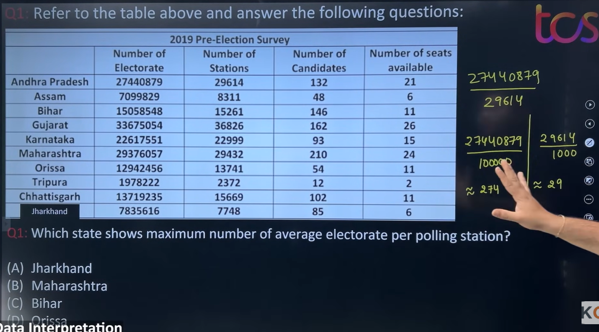

# This is a Table Chart DI question

This is a fantastic question because **almost every beginner gets confused by Data Interpretation (DI)** at first.

The problem is **not the math**.
The problem is **understanding what the English sentence is asking**.

I'll teach you the exact way I solve every DI question.

---

# Step 1: Ignore the numbers first

Don't look at the table.

Read only the question.

It says:

> **Which state shows maximum number of average electorate per polling station?**

Let's break it into pieces.

---

## What is an Electorate?

Electorate = **People who can vote**.

So

```text
Electorate = Number of voters
```

---

## What is a Polling Station?

Polling station = **Voting booth**.

---

Now rewrite the question in simple English.

> **On average, how many voters are assigned to one polling station?**

Now it makes sense.

---

# Step 2: Convert English into Mathematics

Whenever you see

> Average X per Y

Always think

\[
\boxed{\text{Average}=\frac{X}{Y}}
\]

Examples:

Average marks per student

\[
=\frac{\text{Total Marks}}{\text{Students}}
\]

Average salary per employee

\[
=\frac{\text{Total Salary}}{\text{Employees}}
\]

Average voters per polling station

\[
=\frac{\text{Electorate}}{\text{Polling Stations}}
\]

That's exactly what this question is asking.

---

# Step 3: Find which columns are needed

Look at the table.

There are four columns.

| Electorate | Stations | Candidates | Seats |
| ---------- | -------- | ---------- | ----- |

Question asks

> Average electorate per polling station.

Which columns matter?

✅ Electorate

✅ Polling Stations

Ignore

❌ Candidates

❌ Seats

This is the biggest trick in DI.

---

# Step 4: Write the formula

For every state

\[
\frac{\text{Electorate}}{\text{Polling Stations}}
\]

Now compare.

---

# Step 5: Don't do full division!

This is the trick TCS expects.


### Step 1: Understand what the question is asking

> **Which state shows maximum number of average electorate per polling station?**

Translate it.

```text
Average electorate per polling station

=

Electorate
────────────
Polling Stations
```

That's it.

Now look at the options.

```text
A. Jharkhand
B. Maharashtra
C. Bihar
D. Orissa
```

**Only these four states matter.**

Ignore the rest.

---

### Step 2: Simplify the numbers

Your teacher is **not dividing by 1000** here.

He's doing something even smarter.

Look at Jharkhand.

Electorate

```text
7835616
```

He writes

```text
78
```

Stations

```text
7748
```

He writes

```text
7
```

Why?

Because he only wants the **first two significant digits**.

Similarly,

Maharashtra

```text
29376057 → 293

29432 → 29
```

Bihar

```text
15058548 → 150

15261 → 15
```

Orissa

```text
12942456 → 129

13741 → 13
```

He is **keeping only the leading digits** because this is a comparison question.

---

### Step 3: Compare only the options

---

## Option A (Jharkhand)

Approximation

```text
78
──
7
```

Now think.

```text
7 × 11 = 77
```

So

```text
78
── ≈ 11
7
```

---

## Option B (Maharashtra)

```text
293
───
29
```

```text
29 × 10 = 290
```

Therefore

```text
293
─── ≈ 10
29
```

---

## Option C (Bihar)

```text
150
───
15
```

Exactly

```text
10
```

---

## Option D (Orissa)

```text
129
───
13
```

```text
13 × 10 =130
```

Therefore

```text
129
─── ≈10
13
```

---

### Step 4: Compare

| Option      | Approximate Ratio |
| ----------- | ----------------: |
| Jharkhand   |            **11** |
| Maharashtra |                10 |
| Bihar       |                10 |
| Orissa      |                10 |

Clearly,

**11 > 10**

✅ Answer = **Jharkhand (Option A)**

---

# Now let's understand what your teacher is writing on the board

He writes things like

```text
274
──
29
< 10
```

What does that mean?

He is checking

> Is the ratio less than 10 or greater than 10?

Because

If

```text
274
──
29
```

were exactly 10,

then

```text
29 ×10 =290
```

But

```text
274 <290
```

Therefore

```text
274
──
29
<10
```

---

Another example

```text
226
──
22
```

If ratio were 10

```text
22×10=220
```

Since

```text
226>220
```

Ratio is

```text
>10
```

---

Now Jharkhand

```text
78
──
7
```

If ratio were 10

```text
7×10=70
```

But

```text
78>70
```

Try 11

```text
7×11=77
```

Very close.

So

```text
≈11
```

That's why Jharkhand wins.

---

# The biggest trick in TCS DI

Your teacher is **not actually dividing**.

He's asking questions like:

> Is it less than 10?

> Greater than 10?

> Close to 11?

This avoids long division completely.

---

# The method we'll use from now on

Whenever you send me a DI question, we'll solve it like this:

### Step 1

Understand the English.

> What is the question asking?

---

### Step 2

Convert it into a formula.

Example

```text
Electorate
────────────
Polling Stations
```

---

### Step 3

**Check only the options.**

Never calculate all rows unless absolutely necessary.

---

### Step 4

Use **leading-digit approximation** (like your teacher), not full division.

---

### Step 5

Compare using multiplication instead of division.

For example:

Instead of calculating

```text
293 ÷ 29
```

think

> "29 × 10 = 290"

So the answer is about **10**.

---

# How should you think?

Whenever you see the word

```text
per
```

Immediately think

```text
Division
```

Examples

```text
60 km per hour

↓

60 ÷ 1 hour
```

```text
₹40 per kg

↓

40 ÷ 1 kg
```

```text
100 students per classroom

↓

100 ÷ 1 classroom
```

So

```text
Average electorate per polling station

↓

Electorate

÷

Polling station
```

---

# My 5-Step Method for Every DI Question

Whenever you solve any DI question, follow these steps:

### Step 1

Ignore the table.

Read only the question.

---

### Step 2

Underline keywords.

Example

```text
maximum

average

electorate

polling station
```

---

### Step 3

Convert the English into a formula.

Example

```text
Average electorate per station

↓

Electorate

÷

Stations
```

---

### Step 4

Go to the table.

Pick only the required columns.

Ignore everything else.

---

### Step 5

Use estimation instead of exact calculations whenever you're only comparing values.

---

## One thing I want you to remember

In Data Interpretation, **90% of the challenge is understanding what the question is asking**, not doing the math.

So from now on, whenever you send me a DI question, we'll solve it in this order:

1. **Translate the English sentence into simple English.**
2. **Convert it into a mathematical formula.**
3. **Identify which columns are needed.**
4. **Only then calculate.**

This is the approach used by experienced aptitude solvers, and it prevents most mistakes.
