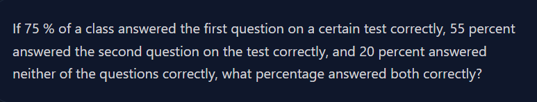

This is **exactly** the point that confuses almost everyone at first.

The answer is:

> **Normally, yes.** To find the **union**, you usually need the **intersection**.

Because,

\[
\text{Union} = A + B - \text{Intersection}
\]

So if you only know:

* A = 75%
* B = 55%

you **cannot** find the union.

---

## Then how did we find the union here?

Because the question gave us **extra information**:

> **20% answered neither question correctly.**

Now think carefully.

There are only **100% of students** in the class.

Those 100% students can be divided into **two groups**:

```text
100% Students
│
├── Answered at least one question
└── Answered neither question
```

These two groups cover **everyone**.

So,

```text
At least one + Neither = 100%
```

Therefore,

```text
At least one = 100% − Neither
```

```text
= 100% − 20%
= 80%
```

That **80% is the Union**.

---

## Where did the 100 come from?

It comes from the fact that **probabilities/percentages always add up to the whole sample**.

If there are 100 students:

* 20 students answered **neither**
* Therefore the remaining **80 students** answered **at least one**

```text
Total students = 100

Answered at least one = 80
Answered neither      = 20
---------------------------
Total                 =100
```

If there were 1000 students instead:

* 200 answered neither
* 800 answered at least one

The **percentage** is still:

```text
80% + 20% = 100%
```

---

## So there are TWO ways to find Union

### Method 1 (using Intersection)

If you know the intersection:

```text
Union = A + B − Intersection
```

Example:

```text
A = 75
B = 55
Intersection = 50

Union = 75 + 55 − 50
      = 80
```

---

### Method 2 (using Neither)

If you know "Neither":

```text
Union = 100 − Neither
```

Example:

```text
Neither = 20

Union = 100 − 20
      = 80
```

---

### That's why this question works.

We **didn't** calculate the union from the intersection.

We calculated it from **Neither**.

Then we used that union to find the intersection.

So the flow was:

```text
Neither
   ↓
Union
   ↓
Intersection
```

not

```text
Intersection
   ↓
Union
```

That's the key idea. The question gives you **another path** to reach the union. Once you have the union, you can use the formula to find the intersection.
