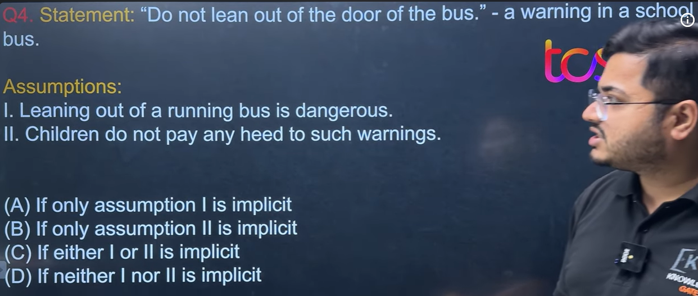

You're right. Let's go through the **entire table** carefully. I'll explain **what each point means, why it is considered strong or weak, and give an example for each**. As you requested, **I'll put the answer after the explanation**, so you can think first.

> **Remember:** This table is **not a strict rulebook**. These are **common patterns** used in aptitude exams. Always check whether the argument is **relevant to the statement**.

---

# 🟢 STRONG ARGUMENTS

---

# 1. Security of Nation

### Meaning

If an argument talks about protecting the country, its citizens, borders, military, or national safety, it is usually considered a **strong argument** because national security is a top priority.

### Example

**Statement:**

> Should the government install more CCTV cameras at railway stations?

**Argument:**

> It will help detect terrorist activities and improve public safety.

---

### Think first...

Is it relevant?

Does it help make the decision?

---

### Answer

✅ **Strong Argument**

Because it is directly related to **national security and public safety**.

---

# 2. Development of a Country

### Meaning

Arguments related to:

* Economic growth
* Employment
* Infrastructure
* Healthcare
* Technology
* Education
* Agriculture

are generally considered strong because they contribute to the country's development.

### Example

**Statement:**

> Should the government build more highways?

**Argument:**

> Better highways improve transportation and boost trade.

---

### Answer

✅ **Strong Argument**

Because it supports **economic development**.

---

# 3. Universal Truth

### Meaning

A universal truth is something that is generally accepted as true everywhere.

Examples:

* Water is essential for life.
* Education improves knowledge.
* Exercise improves health.
* Pollution harms the environment.

These make strong arguments.

### Example

**Statement:**

> Should schools encourage sports?

**Argument:**

> Regular exercise improves physical health.

---

### Answer

✅ **Strong Argument**

Because this is a **universally accepted fact**.

---

# 4. Instructions from Supreme Authority

### Meaning

If an argument is based on laws or instructions from a recognized authority, it is usually strong.

Examples of authorities:

* Supreme Court
* Parliament
* Government
* Election Commission
* RBI
* WHO (for health)
* Police (within their legal powers)

### Example

**Statement:**

> Should people wear helmets while riding motorcycles?

**Argument:**

> It is mandatory under traffic laws.

---

### Answer

✅ **Strong Argument**

Because it is based on a **legal authority**.

---

# 5. Facts Based on Experience

### Meaning

Arguments supported by experience, evidence, or commonly observed facts are strong.

### Example

**Statement:**

> Should companies conduct regular cybersecurity training?

**Argument:**

> Many cyberattacks succeed because employees accidentally click phishing links.

---

### Answer

✅ **Strong Argument**

Because it is based on **real-world experience**.

---

# 6. Educational Development

### Meaning

Arguments that improve:

* Learning
* Skill development
* Literacy
* Student welfare
* Research

are usually considered strong.

### Example

**Statement:**

> Should programming be taught in schools?

**Argument:**

> It helps students develop problem-solving and technical skills.

---

### Answer

✅ **Strong Argument**

Because it promotes **education and skill development**.

---

# 🔴 WEAK ARGUMENTS

---

# 1. Over-exaggeration / Assumption

### Meaning

An argument becomes weak if it:

* Makes huge claims without proof.
* Assumes something without evidence.

### Example

**Statement:**

> Should students use laptops in college?

**Argument:**

> Every student who uses a laptop becomes a genius.

---

### Answer

❌ **Weak Argument**

Because it is an **unrealistic exaggeration**.

---

# 2. Words like Each, Nothing, Every, All, Only

### Meaning

Absolute words often make arguments weak **when they are unsupported**.

Words like:

* All
* Every
* None
* Only
* Always
* Never

require **100% proof**.

### Example

**Statement:**

> Should online learning be encouraged?

**Argument:**

> Every student learns better online.

---

### Answer

❌ **Weak Argument**

Because "every" is an absolute claim that is not justified.

> **Important:** These words are **not always wrong**. If the statement or established fact supports them, they can still be part of a strong argument.

---

# 3. Comparison

### Meaning

Arguments that compare unrelated things without helping answer the statement are weak.

### Example

**Statement:**

> Should India invest more in renewable energy?

**Argument:**

> America also invests in renewable energy.

---

### Answer

❌ **Weak Argument**

Just comparing with another country **doesn't explain why India should do it**.

A better argument would be:

> Renewable energy reduces pollution and improves energy security.

---

# 4. Ambiguous

### Meaning

An ambiguous argument is:

* Vague
* Unclear
* Confusing

It doesn't explain *why*.

### Example

**Statement:**

> Should public parks remain open at night?

**Argument:**

> It is better.

Better in what way?

For whom?

Why?

---

### Answer

❌ **Weak Argument**

Because the reasoning is unclear.

---

# 5. Half Explained Arguments

### Meaning

The argument starts with a good idea but doesn't finish the reasoning.

### Example

**Statement:**

> Should plastic bags be banned?

**Argument:**

> Plastic is dangerous.

Dangerous **how**?

To whom?

What is the connection?

---

### Answer

❌ **Weak Argument**

A stronger version would be:

> Plastic bags pollute rivers, harm wildlife, and take hundreds of years to decompose.

---

# Summary Table

| Strong Argument           | Why?                                        |
| ------------------------- | ------------------------------------------- |
| Security of Nation        | Protects the country and people             |
| Development of Country    | Helps economic or social progress           |
| Universal Truth           | Based on widely accepted facts              |
| Supreme Authority         | Supported by laws or recognized authorities |
| Facts Based on Experience | Backed by evidence or common observation    |
| Educational Development   | Improves learning and skills                |

| Weak Argument                                       | Why?                                       |
| --------------------------------------------------- | ------------------------------------------ |
| Over-exaggeration                                   | Unrealistic or unsupported claims          |
| Unsupported absolute words (All, Every, Only, etc.) | Makes sweeping claims without proof        |
| Comparison                                          | Mere comparison doesn't justify a decision |
| Ambiguous                                           | Unclear reasoning                          |
| Half Explained                                      | Doesn't fully support the statement        |

---

# The Golden Formula for Statement & Argument

Whenever you solve a question, ask these five questions in order:

1. **Is the argument related to the statement?**

   * ❌ No → Weak
   * ✅ Yes → Continue

2. **Is it logical?**

   * ❌ No → Weak
   * ✅ Yes → Continue

3. **Is it realistic and practical?**

   * ❌ No → Weak
   * ✅ Yes → Continue

4. **Does it help a decision-maker decide?**

   * ❌ No → Weak
   * ✅ Yes → Continue

5. **Does it avoid unsupported assumptions, exaggeration, and vague claims?**

   * ✅ Yes → Strong
   * ❌ No → Weak

This checklist will help you solve almost every Statement & Argument question in placement exams, even if the argument doesn't exactly match one of the categories in the table.

---
---
---
---

Great question. These words are very important in **Statement & Assumption**.

But don't memorize that they are **always true** or **always false**. They have different strengths.

---

# 1. Strong / Extreme Words (🚨 Usually False)

These make an assumption **too strong**.

* **All**
* **Every**
* **Each**
* **Only**
* **None**
* **No one / Nobody**
* **Always**
* **Never**

### Example

**Statement:**

> Buy this book to improve your English.

**Assumption:**

> **Every** student needs this book.

❌ False (Too extreme)

---

# 2. Moderate Words (✅ Can be True)

These are not extreme. They often appear in correct assumptions if they fit the statement.

* **Some**
* **Few**
* **Many**
* **Several**
* **Most**
* **Often**
* **Generally**

### Example

**Statement:**

> The government has started a campaign to reduce smoking.

**Assumption:**

> **Some** people smoke.

✅ Reasonable. This **can be implicit**.

---

Another

**Statement:**

> More buses should be introduced.

**Assumption:**

> **Many** people travel by bus.

✅ Can be implicit.

---

# Quick Table

| Word    | Strength | Exam Hint       |
| ------- | -------- | --------------- |
| All     | Extreme  | ❌ Usually False |
| Every   | Extreme  | ❌ Usually False |
| Each    | Extreme  | ❌ Usually False |
| Only    | Extreme  | ❌ Usually False |
| None    | Extreme  | ❌ Usually False |
| No one  | Extreme  | ❌ Usually False |
| Always  | Extreme  | ❌ Usually False |
| Never   | Extreme  | ❌ Usually False |
| Some    | Moderate | ✅ May be True   |
| Few     | Moderate | ✅ May be True   |
| Many    | Moderate | ✅ May be True   |
| Most    | Moderate | ✅ May be True   |
| Several | Moderate | ✅ May be True   |

---

## TCS/Cognizant Shortcut

* **Extreme words** → Be suspicious. They are **usually rejected** unless the statement itself is equally extreme.
* **Moderate words** (`some`, `few`, `many`, `most`) → Don't reject immediately. Check whether they are **necessary hidden beliefs**.

### Memory Trick

> **Extreme = Eliminate first.**
> **Moderate = Investigate first.**
