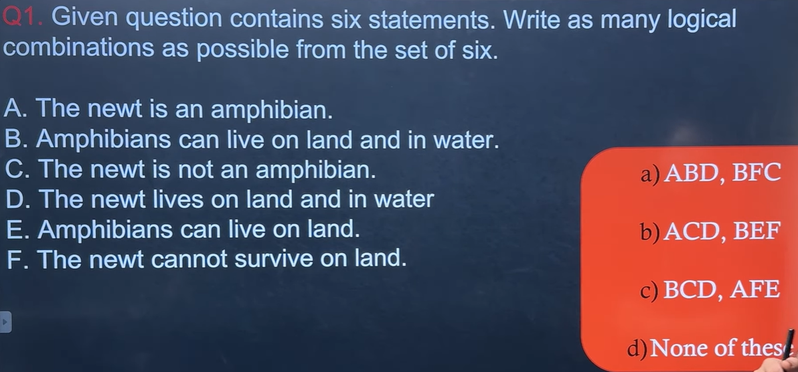

Yes. This is called a **Grouping Based Deductive Reasoning** question.

The biggest mistake students make is trying to **find the correct group first**.

Instead, **eliminate impossible options first**. It's much faster.

---

## Step 1: Write the statements

| Statement | Meaning                                   |
| --------- | ----------------------------------------- |
| A         | Newt is an amphibian.                     |
| B         | Amphibians can live on land and in water. |
| C         | Newt is **not** an amphibian.             |
| D         | Newt lives on land and in water.          |
| E         | Amphibians can live on land.              |
| F         | Newt cannot survive on land.              |

---

# Step 2: Find contradictory pairs

These can **never** be in the same logical group.

### A vs C

A says

> Newt **is** an amphibian.

C says

> Newt **is not** an amphibian.

Impossible together.

❌ A + C

---

### D vs F

D says

> Newt lives on land.

F says

> Newt cannot survive on land.

Impossible.

❌ D + F

---

### B vs F (Think carefully)

B

> Amphibians can live on land and water.

If Newt is connected with amphibians later, F may create contradiction.

Not directly opposite, so don't eliminate yet.

---

# Step 3: Check each option

---

## Option A

### ABD

A → Newt is amphibian

B → Amphibians live on land and water

Therefore

Newt lives on land and water.

Exactly D.

Everything supports each other.

✅ Logical.

---

Second group

### BFC

C

Newt is not amphibian.

F

Newt cannot survive on land.

B

Amphibians live on land and water.

These do **not** contradict.

B is only talking about amphibians.

C says Newt isn't one.

Perfectly possible.

✅ Logical.

---

Option A looks good.

Don't mark yet.

---

## Option B

### ACD

Contains

A

and

C

Direct contradiction.

❌ Eliminate immediately.

No need to see BEF.

---

## Option C

### BCD

B

Amphibians live on land and water.

C

Newt is not amphibian.

D

Newt lives on land and water.

Nothing wrong.

A non-amphibian could also live on land and water.

So first group is okay.

---

Second group

AFE

A

Newt is amphibian.

E

Amphibians live on land.

F

Newt cannot survive on land.

A + E implies

Newt **can** live on land.

F says

Newt **cannot** survive on land.

Contradiction.

❌ Eliminate.

---

Only Option A remains.

✅ **Answer = Option A**

---

# Faster Elimination Trick

Whenever you see these questions,

## Rule 1

Find opposite statements.

Here

* A ↔ C
* D ↔ F

Any option containing them together is immediately wrong.

---

## Rule 2

Use implication.

Example

A + B

↓

D

because

Newt is amphibian

*

Amphibians live on land and water

↓

Newt lives on land and water.

---

## Rule 3

General statement + Particular statement

Example

> Birds can fly.

> Sparrow is a bird.

↓

Sparrow can fly.

Same pattern here.

---

# Visual Logic Map

```
        A
        │
        ▼
Newt is amphibian
        │
        ▼
        B
Amphibians live on land & water
        │
        ▼
        D
Newt lives on land & water
```

Now look at the contradictions.

```
A  ✖  C

D  ✖  F
```

This is the entire logic behind the question.

---

# General Method for All Grouping-Based Questions

Whenever you get one:

**Step 1:** Identify opposite statements (A vs C, Yes vs No, Can vs Cannot).

**Step 2:** Eliminate any option containing direct contradictions.

**Step 3:** Check implication chains:

* General → Specific
* Cause → Effect
* Class → Member

**Step 4:** Ensure every statement in the group supports the others without conflict.

---

These questions appear frequently in TCS, Cognizant, Capgemini, Accenture, and other placement exams. Once you practice spotting **contradictions first**, you can often eliminate half the options in just a few seconds.
