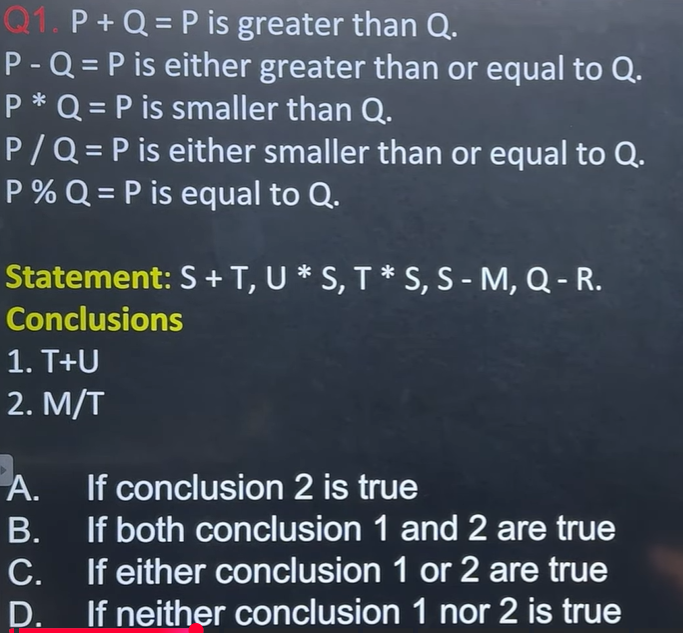

This is a **Mathematical Deductive Reasoning (Symbol-Based Inequality)** question. Once you learn the method, these questions become one of the easiest in placement exams.

---

# Step 1: Decode the symbols

Replace every symbol with its actual meaning.

| Symbol | Meaning |
| ------ | ------- |
| +      | >       |
| -      | ≥       |
| *      | <       |
| /      | ≤       |
| %      | =       |

---

# Step 2: Write the statements in normal mathematical form

Given:

```
S + T
U * S
T * S
S - M
Q - R
```

Convert them.

### 1.

```
S + T
```

means

```
S > T
```

---

### 2.

```
U * S
```

means

```
U < S
```

---

### 3.

```
T * S
```

means

```
T < S
```

(which is the same as S > T)

---

### 4.

```
S - M
```

means

```
S ≥ M
```

---

### 5.

```
Q - R
```

means

```
Q ≥ R
```

This has nothing to do with the conclusions.

Ignore it.

---

So we have

```
S > T
U < S
S ≥ M
```

---

# Step 3: Draw the relationship

Instead of remembering everything, make a small diagram.

```
          S
        /   \
      >       >
     T        U

and

S ≥ M
```

Another way

```
U < S > T

S ≥ M
```

---

# Step 4: Check Conclusion 1

Conclusion:

```
T + U
```

means

```
T > U
```

Can we prove

```
T > U ?
```

No.

Because we only know

```
T < S

and

U < S
```

Both are smaller than S.

But we don't know who is bigger.

Example 1

```
S = 10
T = 8
U = 4
```

Then

```
T > U
```

True.

---

Example 2

```
S = 10
T = 5
U = 8
```

Then

```
T > U
```

False.

Since both are possible,

❌ Conclusion 1 does **not** follow.

---

# Step 5: Check Conclusion 2

Conclusion

```
M / T
```

means

```
M ≤ T
```

We know

```
S ≥ M

S > T
```

Let's test.

---

Example 1

```
S=10

M=8

T=6
```

Then

```
M ≤ T ?

8≤6

False
```

---

Example 2

```
S=10

M=4

T=7
```

Then

```
4≤7

True
```

Again,

Both are possible.

❌ Conclusion 2 does not follow.

---

# Final Answer

Neither conclusion follows.

✅ **Option D**

---

# The Trick Used in Every Such Question

## Rule 1

Always convert the symbols first.

Never solve using symbols directly.

Example

```
+
↓

>
```

---

## Rule 2

Draw the chain.

Example

```
A>B>C>D
```

is much easier to understand than reading line by line.

---

## Rule 3

Ask yourself

**"Can I prove it 100%?"**

If not,

it does **not** follow.

---

# Why Conclusion 1 Fails

Think of this picture.

```
        S
      /   \
     T     U
```

Both are below S.

But who is larger?

No idea.

They can swap positions.

---

# Why Conclusion 2 Fails

```
S ≥ M

S > T
```

This tells us

Both M and T are related to S,

but **there is no direct relationship between M and T**.

So we cannot compare them.

---

# Shortcut for Placement Exams

Whenever you see these questions:

### Step 1

Replace symbols.

### Step 2

Draw a number line or chain.

### Step 3

Check whether the conclusion is **always true**.

* If **always true** → Follows ✅
* If **sometimes true and sometimes false** → Does not follow ❌

---

## One important note about the options

In your image, the options are:

* A. Only conclusion 2 is true
* B. Both 1 and 2 are true
* C. Either 1 or 2 is true
* D. Neither 1 nor 2 is true

Based on the statements shown in the image, **Conclusion 1 does not follow** and **Conclusion 2 does not follow**, so the correct answer is **Option D**.
