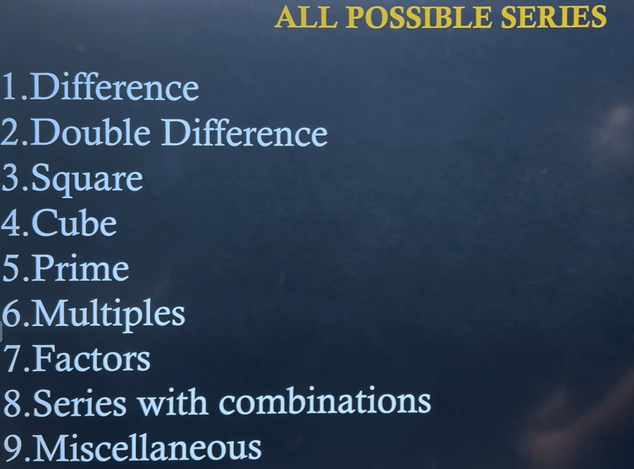

This list is actually a **checklist of every pattern** that can appear in a Letter & Number Series question. If you know these 9 types, you can solve almost any series question asked in placement exams.

Let's understand each one.



---

# 1. Difference Series ⭐⭐⭐⭐⭐

The difference between consecutive numbers is constant.

### Example

```text
5, 10, 15, 20, ?
```

Difference

```text
+5
+5
+5
```

Answer

```text
25
```

---

Another example

```text
30, 27, 24, 21, ?
```

Difference

```text
-3
-3
-3
```

Answer

```text
18
```

---

# 2. Double Difference ⭐⭐⭐⭐⭐

The differences themselves follow a pattern.

### Example

```text
2, 5, 10, 17, 26, ?
```

First difference

```text
+3
+5
+7
+9
```

Now look again.

```text
3,5,7,9
```

Odd numbers.

Next difference

```text
+11
```

Answer

```text
37
```

---

Another example

```text
4, 7, 13, 22, 34, ?
```

Difference

```text
3
6
9
12
```

Pattern

```text
+3
```

Next

```text
+15
```

Answer

```text
49
```

---

# 3. Square Series ⭐⭐⭐⭐⭐

Numbers are perfect squares.

Example

```text
1,4,9,16,25,?
```

means

```text
1²
2²
3²
4²
5²
```

Answer

```text
36
```

---

Sometimes

```text
49,64,81,100,?
```

Answer

```text
121
```

---

# 4. Cube Series ⭐⭐⭐⭐

Example

```text
1,8,27,64,125,?
```

means

```text
1³
2³
3³
4³
5³
```

Answer

```text
216
```

---

# 5. Prime Series ⭐⭐⭐⭐

Example

```text
2,3,5,7,11,13,?
```

Next prime

```text
17
```

---

Sometimes

```text
31,37,41,43,47,?
```

Answer

```text
53
```

---

# 6. Multiples ⭐⭐⭐⭐

Numbers are multiples of a number.

Example

```text
6,12,18,24,30,?
```

Multiples of

```text
6
```

Answer

```text
36
```

---

Another

```text
9,18,27,36,?
```

Answer

```text
45
```

---

# 7. Factors ⭐⭐⭐

Example

Find factors of

```text
24
```

Series

```text
1
2
3
4
6
8
12
24
```

Sometimes they ask

```text
1,2,4,8,16,?
```

These are factors/powers of 2.

Answer

```text
32
```

---

# 8. Combination Series ⭐⭐⭐⭐⭐

Very common in TCS.

Two or more patterns are mixed.

Example

```text
2,4,8,11,22,25,50,?
```

Observe

```text
×2
+3
×2
+3
×2
+3
```

Answer

```text
53
```

---

Another

```text
3,5,10,12,24,26,?
```

Pattern

```text
+2
×2
+2
×2
+2
```

Answer

```text
52
```

---

# 9. Miscellaneous ⭐⭐⭐⭐⭐

Anything that doesn't belong above.

Examples

### Fibonacci

```text
1
1
2
3
5
8
13
21
```

---

### Factorial

```text
1
2
6
24
120
```

---

### Powers

```text
2
4
8
16
32
64
```

---

### Alternate Series

```text
2
5
4
7
6
9
8
11
```

Odd positions

```text
2
4
6
8
```

Even positions

```text
5
7
9
11
```

---

### Alphabet Series

```text
A
C
E
G
I
```

---

### Reverse Alphabet

```text
Z
X
V
T
```

---

# The Order You Should Check During the Exam

Whenever you see a series, don't guess. Follow this checklist:

### Step 1

Is the difference constant?

```text
+2
+5
-3
```

---

### Step 2

If not, check the differences.

```text
3
5
7
9
```

(Double Difference)

---

### Step 3

Check squares.

```text
1
4
9
16
25
```

---

### Step 4

Check cubes.

```text
1
8
27
64
```

---

### Step 5

Check prime numbers.

```text
2
3
5
7
11
```

---

### Step 6

Check multiples.

---

### Step 7

Check alternating patterns.

Split into:

```text
1st
3rd
5th

2nd
4th
6th
```

---

### Step 8

Check combinations.

Like

```text
×2
+3
×2
+3
```

---

### Step 9

Think of special patterns.

* Fibonacci
* Factorial
* Powers
* Alphabet
* Reverse Alphabet

---

## Which types are most common in placement exams?

| Type              | Frequency |
| ----------------- | --------- |
| Difference        | ⭐⭐⭐⭐⭐     |
| Double Difference | ⭐⭐⭐⭐⭐     |
| Combination       | ⭐⭐⭐⭐⭐     |
| Square            | ⭐⭐⭐⭐      |
| Cube              | ⭐⭐⭐       |
| Prime             | ⭐⭐⭐       |
| Multiples         | ⭐⭐⭐       |
| Miscellaneous     | ⭐⭐⭐⭐      |
| Factors           | ⭐⭐        |

So if you're preparing for **TCS, Cognizant, Accenture, Infosys, Capgemini**, focus first on:

1. Difference
2. Double Difference
3. Combination Series
4. Square & Cube
5. Prime Numbers

These account for the majority of Letter & Number Series questions in placement tests.
