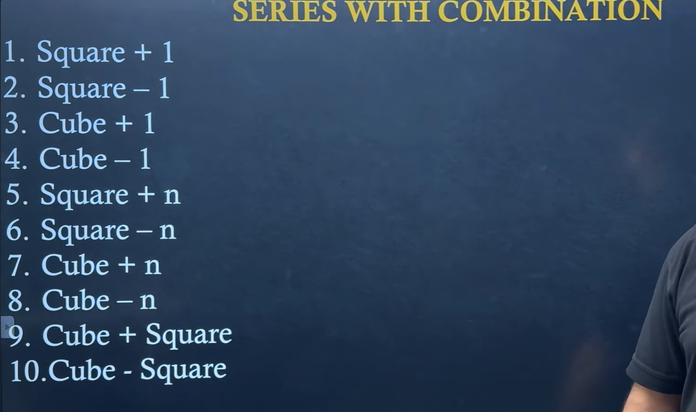

Yes. This is one of the **most common patterns** in Number Series questions asked in **TCS, Cognizant, Wipro, Accenture, Capgemini**, etc.

The image is showing **combinations of squares and cubes**. The examiner takes a normal square or cube series and then **adds or subtracts something** to make it less obvious.

Let's understand every pattern one by one.

---

# First remember these

## Squares

| n  | n²  |
| -- | --- |
| 1  | 1   |
| 2  | 4   |
| 3  | 9   |
| 4  | 16  |
| 5  | 25  |
| 6  | 36  |
| 7  | 49  |
| 8  | 64  |
| 9  | 81  |
| 10 | 100 |

---

## Cubes

| n | n³  |
| - | --- |
| 1 | 1   |
| 2 | 8   |
| 3 | 27  |
| 4 | 64  |
| 5 | 125 |
| 6 | 216 |
| 7 | 343 |
| 8 | 512 |

---

# 1. Square + 1

Formula

\[
n^2+1
\]

Example

Square numbers

```
1 4 9 16 25 36
```

Add 1

```
2 5 10 17 26 37
```

Question

```
2 5 10 17 26 ?
```

Answer

Next square = 36

36 + 1 = **37**

---

# 2. Square − 1

Formula

\[
n^2-1
\]

Example

```
0 3 8 15 24 35
```

Because

```
1-1=0
4-1=3
9-1=8
16-1=15
25-1=24
36-1=35
```

---

# 3. Cube + 1

Formula

\[
n^3+1
\]

Cubes

```
1 8 27 64 125
```

Add 1

```
2 9 28 65 126
```

Question

```
2 9 28 65 ?
```

Answer

126

---

# 4. Cube − 1

Formula

\[
n^3-1
\]

Example

```
0 7 26 63 124
```

Because

```
1-1
8-1
27-1
64-1
125-1
```

---

# 5. Square + n

This is slightly different.

Formula

\[
n^2+n
\]

Example

| n | Square | +n | Answer |
| - | ------ | -- | ------ |
| 1 | 1      | +1 | 2      |
| 2 | 4      | +2 | 6      |
| 3 | 9      | +3 | 12     |
| 4 | 16     | +4 | 20     |
| 5 | 25     | +5 | 30     |

Series

```
2 6 12 20 30
```

Question

```
2 6 12 20 30 ?
```

Next

```
36+6=42
```

Answer

**42**

---

# 6. Square − n

Formula

\[
n^2-n
\]

Example

| n | Square | -n | Answer |
| - | ------ | -- | ------ |
| 1 | 1      | -1 | 0      |
| 2 | 4      | -2 | 2      |
| 3 | 9      | -3 | 6      |
| 4 | 16     | -4 | 12     |
| 5 | 25     | -5 | 20     |

Series

```
0 2 6 12 20
```

Next

```
36-6=30
```

---

# 7. Cube + n

Formula

\[
n^3+n
\]

Example

| n | Cube | +n | Answer |
| - | ---- | -- | ------ |
| 1 | 1    | +1 | 2      |
| 2 | 8    | +2 | 10     |
| 3 | 27   | +3 | 30     |
| 4 | 64   | +4 | 68     |
| 5 | 125  | +5 | 130    |

Series

```
2 10 30 68 130
```

---

# 8. Cube − n

Formula

\[
n^3-n
\]

Example

| n | Cube | -n | Answer |
| - | ---- | -- | ------ |
| 1 | 1    | -1 | 0      |
| 2 | 8    | -2 | 6      |
| 3 | 27   | -3 | 24     |
| 4 | 64   | -4 | 60     |
| 5 | 125  | -5 | 120    |

Series

```
0 6 24 60 120
```

---

# 9. Cube + Square

Formula

\[
n^3+n^2
\]

Example

| n | Cube | Square | Answer |
| - | ---- | ------ | ------ |
| 1 | 1    | 1      | 2      |
| 2 | 8    | 4      | 12     |
| 3 | 27   | 9      | 36     |
| 4 | 64   | 16     | 80     |
| 5 | 125  | 25     | 150    |

Series

```
2 12 36 80 150
```

---

# 10. Cube − Square

Formula

\[
n^3-n^2
\]

Example

| n | Cube | Square | Answer |
| - | ---- | ------ | ------ |
| 1 | 1    | 1      | 0      |
| 2 | 8    | 4      | 4      |
| 3 | 27   | 9      | 18     |
| 4 | 64   | 16     | 48     |
| 5 | 125  | 25     | 100    |

Series

```
0 4 18 48 100
```

---

# How to identify these in the exam

Don't immediately start calculating every term. Use a quick elimination process.

### Step 1: Ask yourself

Does it look close to **squares**?

Example

```
2 5 10 17 26
```

Compare with squares

```
1 4 9 16 25
```

Difference

```
+1 +1 +1 +1 +1
```

✔ Pattern = **Square + 1**

---

### Step 2: Check cubes

Example

```
2 9 28 65
```

Cubes

```
1 8 27 64
```

Difference

```
+1 +1 +1 +1
```

✔ Pattern = **Cube + 1**

---

### Step 3: Check if the difference increases with n

Example

```
2 6 12 20 30
```

Squares

```
1 4 9 16 25
```

Difference

```
+1
+2
+3
+4
+5
```

✔ Pattern = **Square + n**

---

### Step 4: Check options first (your shortcut)

This is the trick you've been practicing, and it's very effective for MCQs.

Suppose the question is:

```
2 6 12 20 30 ?
```

Options:

```
A) 40
B) 41
C) 42
D) 43
```

Instead of deriving the whole rule, notice the series resembles **Square + n**. The next value would be:

```
6² + 6 = 36 + 6 = 42
```

Only option **42** fits, so you don't waste time testing every possibility.

---

## The 10 combination patterns you should memorize

| Pattern       | Formula   |
| ------------- | --------- |
| Square + 1    | (n^2+1)   |
| Square − 1    | (n^2-1)   |
| Cube + 1      | (n^3+1)   |
| Cube − 1      | (n^3-1)   |
| Square + n    | (n^2+n)   |
| Square − n    | (n^2-n)   |
| Cube + n      | (n^3+n)   |
| Cube − n      | (n^3-n)   |
| Cube + Square | (n^3+n^2) |
| Cube − Square | (n^3-n^2) |

---

From now on, I'll solve number series the way you've found most helpful:

1. **Look at the series and identify the closest base pattern (square, cube, etc.).**
2. **Use quick logical checks or the options first whenever possible.**
3. **Avoid unnecessary calculations and explain why the correct option fits.**
