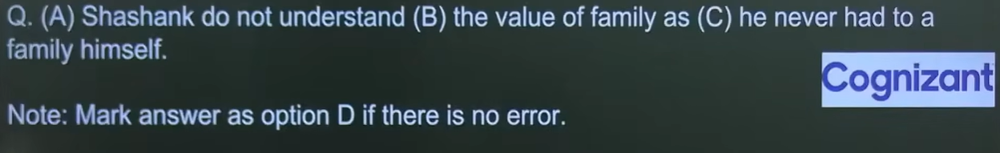

This type of question is called **Error Spotting** or **Sentence Error Detection**.

It is one of the most common question types in exams like SSC, Banking, CAT, Placement Tests, TCS, Cognizant, Accenture, Wipro, etc.

---

# How this question works

The sentence is divided into parts.

```
(A) Shashank do not understand
(B) the value of family
(C) as he never had a family himself.
(D) No Error
```

Your job is to find **which part contains the grammatical mistake**.

If there is no mistake, choose **Option D (No Error).**

---

# The Process You Should Follow

Never guess.

Always check the sentence in the same order.

## Step 1 — Find the Subject

Ask:

> Who is doing the action?

Here,

```
Shashank
```

Subject = **Shashank**

It is

* Singular
* Third Person

Immediately your brain should think

> Singular subject needs a singular verb.

---

## Step 2 — Find the Verb

```
do not understand
```

Now ask,

Is this verb correct for **Shashank**?

No.

We say

```
I do
You do
We do
They do

He does
She does
It does
Shashank does
```

So

```
Shashank do ❌

Shashank does ✅
```

But notice something else...

The sentence already has **not**.

So it should become

```
does not understand
```

not

```
do not understand
```

Therefore,

**Part (A) contains the error.**

---

# Why "understand" doesn't become "understands"

Many beginners ask this.

When we use

```
does
```

the main verb stays in its base form.

Examples

```
He plays.
```

But

```
He does play.
```

NOT

```
He does plays.
```

Similarly,

```
He understands.
```

But

```
He does understand.
```

NOT

```
He does understands.
```

---

# Step 3 — Check the Remaining Parts

Part B

```
the value of family
```

Looks correct.

---

Part C

```
as he never had a family himself.
```

Also grammatically correct.

So only Part A has the error.

---

# Final Answer

✅ **Option A**

Correct sentence:

> **Shashank does not understand the value of family as he never had a family himself.**

---

# The 7-Step Method for Every Error Spotting Question

Whenever you solve one, follow this exact order:

### 1. Find the Subject

Who is doing the action?

---

### 2. Check Subject–Verb Agreement

Examples

```
He do ❌
He does ✅

They does ❌
They do ✅
```

---

### 3. Check the Tense

Look for words like

* yesterday
* now
* since
* for
* tomorrow
* already

Make sure the verb matches the time.

---

### 4. Check Articles

```
a
an
the
```

Example

```
an university ❌

a university ✅
```

---

### 5. Check Pronouns

Examples

```
Everyone should bring their book.
```

(Some exams may expect "his or her" depending on the grammar standard.)

Or

```
Me and Rahul ❌

Rahul and I ✅
```

---

### 6. Check Prepositions

Examples

```
good in Maths ❌

good at Maths ✅
```

---

### 7. Read the Whole Sentence Once Again

Sometimes every individual part looks fine, but the complete sentence sounds wrong.

Always read it once after checking each part.

---

# Common Types of Error Spotting Questions

You'll usually encounter errors in these areas:

1. Subject–Verb Agreement ✅ (like this question)
2. Tense
3. Articles (a, an, the)
4. Pronouns
5. Prepositions
6. Conjunctions
7. Modals (can, could, should, would)
8. Parallelism
9. Comparison
10. Adjectives vs Adverbs
11. Active & Passive Voice
12. Reported Speech
13. Conditional Sentences
14. Double Negatives
15. Word Order

---

Since you're learning English from the basics, I recommend solving them in this order:

1. Subject–Verb Agreement
2. Tenses
3. Articles
4. Pronouns
5. Prepositions
6. Modals
7. Conjunctions
8. Comparison
9. Parallelism
10. Mixed Error Spotting

This sequence builds your grammar naturally, and after each topic you'll notice that these error-spotting questions become much easier.
