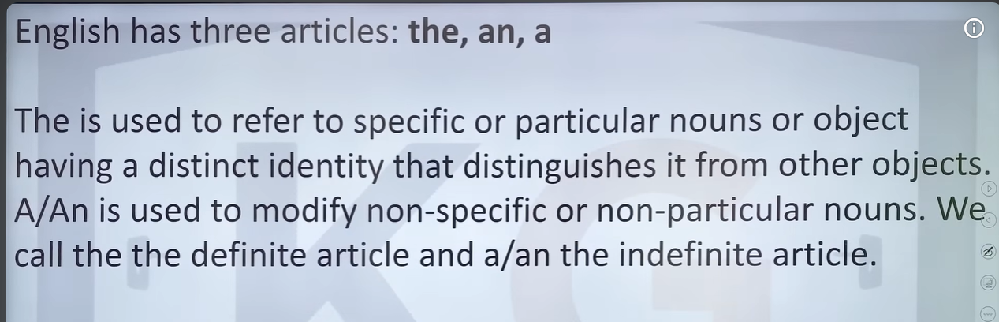

Excellent. **Articles** are one of the **most important grammar topics** in placement exams (TCS, Cognizant, Wipro, Accenture, Capgemini). If you master this topic, you'll solve many sentence improvement and error detection questions.

Let's learn it **from zero**.

---

# What is an Article?

An **article** is a small word placed **before a noun**.

There are only **3 articles** in English.

| Article | Type               |
| ------- | ------------------ |
| a       | Indefinite Article |
| an      | Indefinite Article |
| the     | Definite Article   |

Examples

* a boy
* an apple
* the sun

Notice:

The article always comes before the noun.

```
Article + Noun

a dog

an engineer

the teacher
```

---

# First understand what a noun is

A noun is the name of a

* person
* place
* thing
* animal

Examples

Person → Rahul

Place → Kolkata

Thing → Book

Animal → Dog

Articles come before these nouns.

---

# Let's understand your first image

The image says:

> English has three articles:
>
> **the, an, a**

Correct.

---

Next it says

> **The** is used to refer to specific or particular nouns.

Let's understand.

Suppose there are 100 books.

You tell your friend

> Give me **the** book.

Which book?

The one both of you already know.

So "the" refers to one specific thing.

---

The image then says

> A/An is used to modify non-specific nouns.

Meaning

You don't care which one.

Example

> Give me a pen.

Any pen is okay.

Not a specific pen.

---

The image also says

> We call **the** the definite article.

Why?

Because

**definite = fixed = specific**

---

Then

> We call **a/an** indefinite articles.

Why?

Because

**indefinite = not fixed = any one**

---

# Let's understand the second image

It says

> The is used with things that are unique or already mentioned before.

This sentence has two important rules.

---

# Rule 1

Use **the** when something is unique.

Unique means

Only one exists.

Examples

The Sun

The Moon

The Earth

The Taj Mahal

The Prime Minister

The President

Because there is only one in that context.

Example

✅ The sun rises in the east.

Not

❌ A sun rises...

---

# Rule 2

Use **the** when it was already mentioned.

Example

I bought **a** laptop.

Now the listener doesn't know which laptop.

Later

The laptop is very fast.

Now we use "the"

because we already talked about it.

This is one of the most common rules.

---

# Now understand A

Image says

> A is used with things that are not specific.

Suppose you're hungry.

You say

I want **a** burger.

You don't care which burger.

Any burger.

---

Another example

I need a pen.

You are not asking for one particular pen.

Any pen will work.

---

# Now understand AN

Many students think

> Use AN before vowels.

This is only half correct.

The real rule is

## We use **an** before a vowel SOUND.

Not vowel LETTER.

This is extremely important.

---

Examples

an apple

Why?

Apple starts with the sound

"A"

So use

AN

---

Another

an elephant

Starts with

"E"

Use

AN

---

Another

an orange

Starts with

"O"

Use

AN

---

Another

an umbrella

Starts with

"U"

Pronounced

uh-mbrella

Starts with vowel sound.

So

AN

---

# Very Important

The image says

> If a word starts with a vowel but has the sound of a consonant, use **A**.

This confuses almost everyone.

Don't look at the first LETTER.

Look at the first SOUND.

---

Example 1

University

First letter?

U

Looks like a vowel.

But pronounce it.

University

Starts with

"YOU"

That is a consonant sound.

So

✅ a university

NOT

❌ an university

---

Example 2

Union

Pronounced

YOU-nion

Again

Starts with "YOU"

So

✅ a union

---

Example 3

European

Pronounced

YOU-ro-pean

Again

YOU

So

✅ a European

---

Example 4

One

Starts with

O

But pronounce it

Wun

Starts with W sound.

So

✅ a one-rupee coin

NOT

❌ an one-rupee coin

That's exactly what your image is saying.

---

# Opposite Case

Sometimes the first letter is a consonant but the sound is a vowel.

Example

Honest

Starts with

H

But pronounce it

ON-est

H is silent.

Starts with O sound.

So

✅ an honest man

---

Hour

Pronounced

Our

Starts with vowel sound.

So

✅ an hour

---

Heir

Pronounced

Air

Starts with vowel sound.

So

✅ an heir

---

MBA

Starts with M

But pronounce it

EM-BEE-A

Starts with "E"

So

✅ an MBA graduate

---

FBI

Pronounced

EF-BI

Starts with E sound.

So

✅ an FBI officer

---

# Easy Trick

Never ask

> Is the first letter a vowel?

Instead ask

> **How do I pronounce the first sound?**

If it starts with

```
A E I O U sound

Use AN
```

If it starts with

```
Y W B C D F...
sound

Use A
```

---

# THE (Most Important Rules)

## 1. Unique Things

The Sun

The Moon

The Earth

---

## 2. Already Mentioned

I bought a bike.

The bike is blue.

---

## 3. Rivers

The Ganga

The Nile

---

## 4. Oceans

The Indian Ocean

The Pacific Ocean

---

## 5. Mountain Ranges

The Himalayas

The Alps

But

Mount Everest

(No "the")

---

## 6. Newspapers

The Times of India

The Hindu

---

## 7. Superlatives

The best

The biggest

The tallest

Example

Sachin is **the greatest** batsman.

---

## 8. Ordinal Numbers

The first

The second

The third

---

## 9. Musical Instruments

He plays the guitar.

She plays the piano.

---

# When NOT to use THE

Names of people

Rahul

Priya

Not

❌ The Rahul

---

Countries

India

Japan

France

No article.

Exceptions

The United States

The United Kingdom

The Netherlands

The UAE

---

Languages

English

Hindi

Bengali

Not

❌ The English

---

Meals

Breakfast

Lunch

Dinner

Normally

I had breakfast.

Not

I had the breakfast.

(Unless you're talking about a specific breakfast.)

---

# Quick Summary

| Article | Use                                                 |
| ------- | --------------------------------------------------- |
| A       | Singular, starts with consonant sound, not specific |
| An      | Singular, starts with vowel sound, not specific     |
| The     | Specific, unique, already mentioned                 |

---

# Memory Trick

Imagine you're talking about a dog.

You see a dog for the first time.

> I saw **a** dog.

The listener asks,

Which dog?

Now both of you know.

> **The** dog was black.

So the flow is usually:

```
First time

↓

A / AN

Second time

↓

THE
```

---

# Placement Exam Questions

These are the most common article mistakes you'll see:

1. **a** vs **an** (based on sound, not letter)
2. Missing **the** before unique things
3. Unnecessary **the** before countries, languages, or people's names
4. **the** with superlatives (*the best*, *the largest*)
5. **the** after mentioning a noun for the second time

These patterns appear frequently in sentence improvement and error detection questions.

Once you're comfortable with these basics, we can practice 30–40 article questions from easy to placement level so that recognizing the correct article becomes almost automatic.
